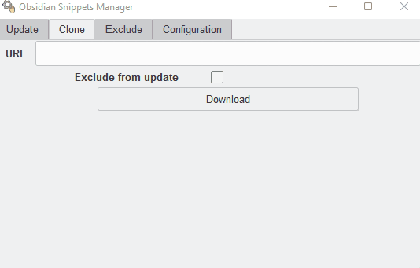

Obsidian Snippet Manager is a python script that git pull and move CSS file in your `.obsidian/snippet` folder.

The goal is to provide a practical way to get semi-auto-update from CSS snippet hosted on GitHub, in waiting of an eventual BRAT update that support that.

# Get started
## Requirements
1. [Git](https://git-scm.com/downloads)
2. [Python](https://www.python.org/downloads/)
3. `pip install Obsidian-Snippet-Manager --upgrade`

# GUI


You can use the application with an interface, using (in terminal): `snipetter`.

Alternatively, you can download and unzip the latest release for your OS. But, beware : the exe prevent you to get the cli command, so you **can't** use the autoupdate from obsidian-shell.
Also, the release executable will don't save the environment file at the same place of the package, so you need to save it before update it !

# CLI
## Environment
The plugin needs :
- The **absolute** path of your vault, as : `G:\Drive\Vault`
- A folder that contains **all** the snippet you want to get the update.
This folder can be everywhere on your computer (yes, it can be in `.obsidian` too.). It will contain all folder of the snippet hosted on GitHub you want to use.  
    _In case of the folder doesn't exist, the script will create it!_

## How to use
1. Adding a new repo : `obsnipe clone repository_url`  
    Additionally, you can exclude a folder from update with adding the `--exclude` command : `obsnipe clone --excluded [repository_url]`
2. Updating everything : `obsnipe`
3. Updating only a repository : `obsnipe update folder_name` 
    The folder name is the folder that you wish to update the snippet!

The script will :
- Git pull 
- Git move every `.css` file in your `.obsidian/snippet` folder. 

## Other function
- `obsnipe list` : List all GitHub Repository you download.
- `obsnipe exclude [folder_name]` : Exclude a folder from update. You can exclude multiple value using : `obsnipe exclude [folder1] [folder2]`

Note : You can exclude a folder from auto-update using the `exclude.yml` file, placed in your Snippet Manager folder. 
You need to add the folder name as a yaml list :
```yml
- foldername1
- foldername2
```

# Example 
*Using [Obsidian Snippets Collection](https://github.com/Mara-Li/Obsidian-Snippet-collection)*
1. Configuration : 
    - Vault is in : `G:/Drive/vault`
    - My Obsidian Manager Folder is in : `D:/Documents/Github/Snippets Manager`
2. `obsnipe clone https://github.com/Mara-Li/Obsidian-Snippet-collection`
3. Activate the snippets 🎉

To update this specific snippet : `obsnipe update Obsidian-Snippet-collection`

# In obsidian 

You can create a command in Obsidian using [Obsidian Shell](https://github.com/Taitava/obsidian-shellcommands).


*Bonus, you can update your snippet every time obsidian start, like BRAT!*

⚠️ **WARNING** : Every edit on a snippet downloaded by this way will break the script. Please, DON'T EDIT these file, and use another snippet. (Or, use a fork and commit before.)

# Credit
- <a href="https://www.flaticon.com/free-icons/manual" title="manual icons">Manual icons created by LAFS - Flaticon</a>
- [Boxicon](https://boxicons.com/)
